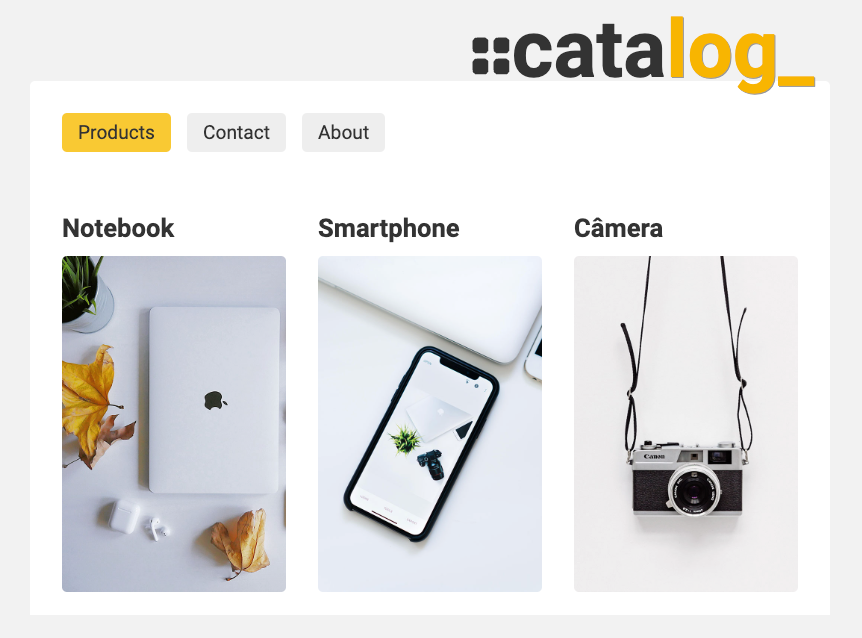

# catalog\_

## Welcome / Bem vindo!

Thanks for checking out my front-end project. 
🇧🇷/🇵🇹 _Obrigado por conferir meu projeto de front-end._

## Overview

A dinamic web app to display your catalog. Built with React. 
_Um aplicativo dinamico para expor seu catálogo. Construído com React._

## Project main goals

- Develop a React App using Vite, instead of CRA - Create React App;
- Practise routing with React Routes;
- Fetch data from a Rest API using async functions and the useEffect hook;
- Use CSS transitions for each section;
- Consume icons from the React Icons library.

## Links

- App URL (Deploy): [https://wseguchi.github.io/catalog\_](https://wseguchi.github.io/catalog_/)
- Github Repository: [https://github.com/wseguchi/catalog\_](https://github.com/wseguchi/catalog_)

## Author

- Wildson Seguchi
- [Github](https://github.com/wseguchi)
- [LinkedIn](https://www.linkedin.com/in/wildson-seguchi/?locale=en_US)
